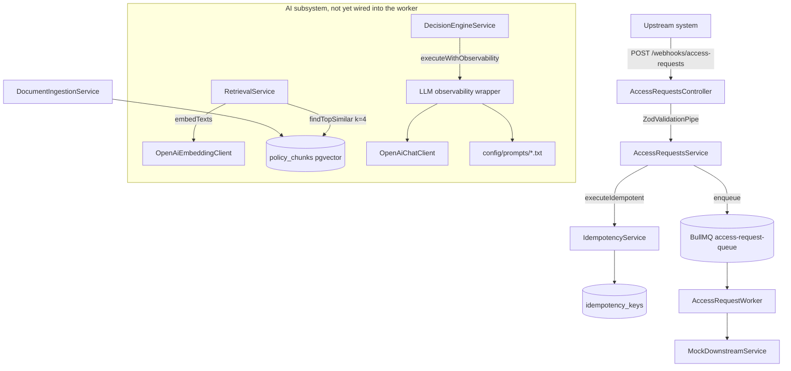
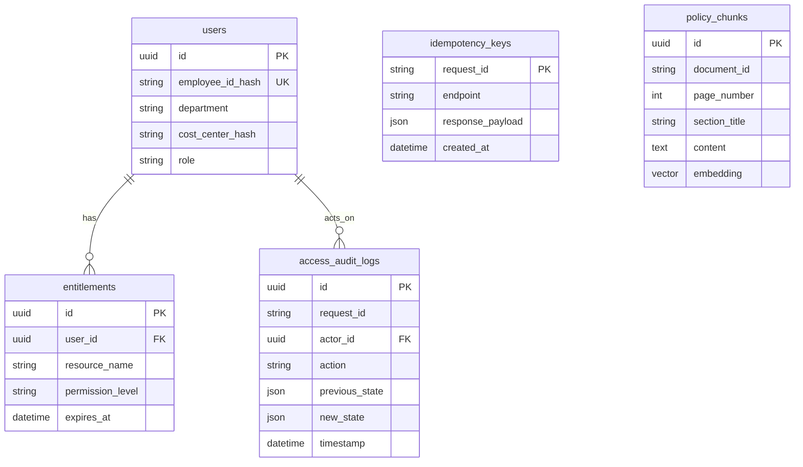

# Policy-Pilot — Codebase Reference

Snapshot of the repository as of commit `0e11a1c` (`feat(ai): add HITL-isolated DecisionEngine with structured LLM output`), branch `feat/policy-chunk-pgvector`.

Policy-Pilot ingests self-service access requests over a webhook, retrieves grounding context from policy PDFs stored as pgvector embeddings, and asks an LLM for a structured `APPROVE | DENY | ESCALATE` recommendation. A human reviewer makes the final call — the LLM never mutates entitlements.

---

## 1. Repository layout

```
policy-pilot/
├── apps/
│   ├── backend/            NestJS API, workers, RAG pipeline, Prisma
│   └── frontend/           React + Vite + Tailwind HITL dashboard (scaffold)
├── packages/
│   └── shared-types/       Cross-app TypeScript interfaces
├── shared/                 PII masking utility (@policy-pilot/shared)
├── docker/postgres/        pgvector init SQL
├── .cursor/rules/          Architecture rules enforced on agents
├── .cursor/skills/         Repeatable agent procedures
├── docker-compose.yml      Postgres (pgvector) + Redis
├── jest.config.js          Unit suite
├── jest.integration.config.js  Integration suite (needs live infra)
└── AGENTS.md               Agent-facing repo guide
```

npm workspaces: `apps/*`, `packages/*`, `shared`. Node `>=22`.

---

## 2. Tech stack

| Layer    | Choice                                                                                          |
| -------- | ----------------------------------------------------------------------------------------------- |
| Language | TypeScript 5.8, strict mode, `no-explicit-any` enforced as an ESLint error                      |
| Backend  | NestJS 11, Zod 3 validation, Prisma 6                                                           |
| Database | PostgreSQL 16 with pgvector (`pgvector/pgvector:pg16`)                                          |
| Queue    | BullMQ 5 on Redis 7, via `@nestjs/bullmq`                                                       |
| AI       | OpenAI SDK 7 (`text-embedding-3-small`, `gpt-4o-mini`), `@langchain/textsplitters`, `pdf-parse` |
| Frontend | React 19, Vite 6, Tailwind 3, TanStack Query 5 (installed, not yet wired)                       |
| Testing  | Jest 29 + ts-jest; Supertest for integration                                                    |

---

## 3. Commands

| Command                                                    | Purpose                                                                                    |
| ---------------------------------------------------------- | ------------------------------------------------------------------------------------------ |
| `npm run verify`                                           | Full gate: `format && lint && type-check && test`. Also runs as the Husky pre-commit hook. |
| `npm test`                                                 | Unit suite (no infrastructure required)                                                    |
| `npm run test:integration`                                 | Burst/idempotency suite; requires `docker compose up -d`                                   |
| `npm run build`                                            | Builds all workspaces                                                                      |
| `npm --workspace=@policy-pilot/backend run prisma:migrate` | Apply migrations                                                                           |
| `npm --workspace=@policy-pilot/frontend run dev`           | Vite dev server                                                                            |

Current state of the unit suite: **15 suites, 69 tests, all passing.**

The backend build step copies `src/config/prompts/*.txt` into `dist/`, because prompts are loaded from disk at runtime relative to `__dirname`.

---

## 4. Runtime architecture



Request lifecycle today: webhook accepted with `202 Accepted` and a `statusUrl`, job queued with exponential backoff, worker executes idempotently against a rate-limited mock downstream. Retrieval and the decision engine exist and are exported, but the worker does not call them yet.

---

## 5. Backend modules

### `app.module.ts`

Imports `ConfigModule` (global), `DatabaseModule`, `QueueModule`, `IdempotencyModule`, `AuditLogModule`, `AccessRequestsModule`, `AiModule`. Registers `HttpExceptionFilter` as a global `APP_FILTER`. `AppController` exposes `GET /health`.

### `modules/database` (`@Global`)

`PrismaService` extends `PrismaClient` and connects/disconnects on Nest lifecycle hooks. Repositories exported globally:

| Repository                 | Operations                                           |
| -------------------------- | ---------------------------------------------------- |
| `UserRepository`           | `create`, `findByEmployeeIdHash`, `findById`         |
| `EntitlementRepository`    | `create`, `findByUserId`                             |
| `IdempotencyKeyRepository` | `create`, `upsert`, `findByRequestId`                |
| `AccessAuditLogRepository` | `create` (Zod-validated, append-only)                |
| `PolicyChunkRepository`    | `bulkInsert`, `deleteByDocumentId`, `findTopSimilar` |

`PolicyChunkRepository` uses raw SQL because Prisma treats `vector(1536)` as `Unsupported`. Vectors are serialized to a `[a,b,c]` literal and cast with `::vector`. Similarity search:

```80:85:apps/backend/src/modules/database/repositories/policy-chunk.repository.ts
  public async findTopSimilar(
    embedding: number[],
    limit: number,
  ): Promise<PolicyChunkSimilarityRow[]> {
    const query = SimilarityQuerySchema.parse({ embedding, limit });
    const embeddingLiteral = `[${query.embedding.join(',')}]`;
```

### `modules/access-requests`

| File                            | Role                                                                                        |
| ------------------------------- | ------------------------------------------------------------------------------------------- |
| `access-requests.controller.ts` | `POST /webhooks/access-requests`, `202 Accepted`, Zod pipe on the body                      |
| `access-requests.service.ts`    | Wraps enqueue in `executeIdempotent`; returns `{ status, requestId, statusUrl }`            |
| `access-request.worker.ts`      | BullMQ `@Processor`, concurrency 2, limiter matched to the downstream contract              |
| `access-requests.constants.ts`  | Queue names, endpoints, backoff/jitter helpers                                              |
| `mock-downstream.service.ts`    | In-memory sliding-window limiter that throws `MockDownstreamRateLimitError` past 60 req/60s |
| `dto/access-requests.dto.ts`    | `{ requestId, employeeId, targetEntitlement }`                                              |

The worker uses a namespaced idempotency key (`worker:access-request:<id>`) so a redelivered job is distinguishable from the original webhook.

### `modules/idempotency`

`executeIdempotent` looks up `request_id`, replays the stored payload if present, otherwise runs the callback and persists the response. A `P2002` unique-violation is treated as a lost race and re-read rather than failing.

### `modules/audit-log`

`AuditLogService.append` validates input, runs `previousState` / `newState` through `maskPII`, and writes to the append-only `access_audit_logs` table.

### `modules/queue`

`BullModule.forRootAsync` reading `REDIS_HOST`, `REDIS_PORT`, and an optional `REDIS_QUEUE_PREFIX` used by integration tests to isolate keys.

### `config/rate-limit.config.ts`

Env is parsed at **module import time**, not through `ConfigService`, because the BullMQ `@Processor` decorator evaluates its `limiter` options before the DI container exists. It derives `ACCESS_REQUEST_JOB_ATTEMPTS` such that cumulative exponential backoff outlasts one full rate-limit window, with a floor of 5 attempts.

### `common/`

- `ZodValidationPipe` — converts `ZodError` into `BadRequestException` with a flattened error body.
- `HttpExceptionFilter` — passes through `HttpException`, and collapses Prisma and unknown errors into a generic `500 Internal server error` so stack traces and SQL never reach clients.

---

## 6. AI subsystem (`modules/ai`)

```
modules/ai/
├── ai.module.ts                    DI wiring
├── index.ts                        public barrel
├── document-chunker.ts             recursive splitter, 1000/200, heading detection
├── document-ingestion.service.ts   PDF → chunks → embeddings → Postgres
├── retrieval.service.ts            access request → embedding → top-k=4
├── decision-engine.service.ts      chunks + request → validated Decision
├── chat/                           CHAT_CLIENT + OpenAiChatClient
├── embedding/                      EMBEDDING_CLIENT + OpenAiEmbeddingClient
├── dto/document-ingestion.dto.ts   PolicyDocumentChunkSchema (snake_case)
├── observability/                  executeWithObservability, logger, cost estimator
├── prompts/access-decision.prompt.ts  thin loader over the prompt manifest
└── schemas/recommendation.schema.ts   RecommendationSchema + DecisionSchema alias
```

### Ingestion

`DocumentIngestionService.ingestPoliciesDirectory()` reads every PDF in `apps/backend/data/policies/` (ten seeded policy documents, `POL-2026-01` through `POL-2026-10`), extracts text per page, chunks it, embeds it, and bulk-inserts. Re-ingest is idempotent: rows for a `document_id` are deleted before insert. The CLI entrypoint is `scripts/run-policy-ingest.ts`, which also prints per-document chunk counts.

`pdf-dom-polyfill.ts` is imported for its side effects to give `pdf-parse` the DOM globals it expects under Node.

### Retrieval

`RetrievalService.retrieve(request)` builds a PII-safe query string from `targetEntitlement` only, embeds it, and runs cosine search. `RETRIEVAL_TOP_K = 4` is a module constant that callers cannot override.

```41:43:apps/backend/src/modules/ai/retrieval.service.ts
  private buildQueryText(targetEntitlement: string): string {
    return `Access entitlement request: ${targetEntitlement}`;
  }
```

Rows are mapped from camelCase (DB boundary) to the snake_case `PolicyDocumentChunk` shape used in LLM payloads, preserving `document_id`, `page_number`, and `section_title` for citations.

### Decision engine

`DecisionEngineService.decide({ request, policyChunks })` returns a validated `Decision` or throws. Its only injected dependency is `CHAT_CLIENT` — no Prisma, no repositories, no audit writer. That is the HITL isolation boundary: the engine physically cannot mutate state.

```47:49:apps/backend/src/modules/ai/decision-engine.service.ts
    if (result.data === null || !result.observation.schemaValid) {
      throw new InternalServerErrorException('Internal server error');
    }
```

### Structured output schema

```3:16:apps/backend/src/modules/ai/schemas/recommendation.schema.ts
export const PolicyCitationSchema = z.object({
  document_id: z.string().min(1),
  page_number: z.number().int().positive(),
  section_title: z.string().min(1),
});

export const RecommendationDecisionSchema = z.enum(['APPROVE', 'DENY', 'ESCALATE']);

export const RecommendationSchema = z.object({
  decision: RecommendationDecisionSchema,
  rationale: z.string().min(1),
  policy_citations: z.array(PolicyCitationSchema),
  confidence_score: z.number().min(0).max(1),
});
```

`DecisionSchema` is an alias of `RecommendationSchema`, so there is exactly one source of truth for LLM output shape.

### Prompts

Prompt bodies live on disk as semver-named text files and are never inlined in application code:

| Key             | File                       | Content                                                                                             |
| --------------- | -------------------------- | --------------------------------------------------------------------------------------------------- |
| `system-policy` | `system-policy-v1.0.0.txt` | Grounding rules, mandatory ESCALATE on insufficient context, no-mutation rule, citation requirement |
| `rag-synthesis` | `rag-synthesis-v1.0.0.txt` | Synthesis template with `{{ACCESS_REQUEST_JSON}}` / `{{POLICY_CHUNKS_JSON}}` placeholders           |

`loadPrompt(key)` resolves the file next to the compiled manifest, throwing if missing. `ACCESS_DECISION_PROMPT_KEY` currently points at `system-policy`.

### Observability

Every LLM call goes through `executeWithObservability(request, schema, logger)`, which:

1. Loads the prompt and appends the JSON payload,
2. Builds a **separately masked** copy of the prompt for logging via `maskPII`,
3. Times the call, `JSON.parse`s the response, and `safeParse`s it against the schema,
4. Emits an observation with prompt name and version, model, masked input/output, token counts, latency, estimated USD cost, `schemaValid`, and flattened `schemaErrors`,
5. Returns `{ data: T | null, observation }` — it never throws on invalid output; callers decide.

`estimateCostUsd` prices `gpt-4o-mini` and `gpt-4o`, defaulting to mini pricing for unknown models.

---

## 7. Data model



`policy_chunks` is standalone (no FK to documents) and indexed on `document_id` only. There is **no ANN index** on `embedding` yet, so similarity search is an exact scan — fine at current corpus size, worth revisiting as chunk count grows.

Note that `users` stores `employee_id_hash` and `cost_center_hash`, never raw identifiers. The seed data uses pre-computed SHA-256 digests for the same reason.

Migrations:

- `20260805212600_init_core_entities`
- `20260807161214_add_vector_schema` — `CREATE EXTENSION IF NOT EXISTS vector` plus the `policy_chunks` table

---

## 8. Guardrails

These are enforced by `.cursor/rules/` and `AGENTS.md`, and are load-bearing for how code is structured.

**LLM suggests, human approves.** The decision engine returns a recommendation object and nothing else. It has no write dependencies. No LLM output path reaches an entitlement mutation.

**PII masking.** `maskPII` (in `shared/pii/mask-pii.ts`) recursively masks `employee_id`, `cost_center`, `ssn`, and `email` keys, rendering `E1234567` as `E1***67` and anything four characters or shorter as `****`. It is applied in audit log writes and in every LLM observation. Retrieval and decision payloads deliberately omit `employeeId` entirely.

**Deterministic validation.** Zod at every boundary: HTTP bodies (`ZodValidationPipe`), repository inputs, chunk DTOs, env config, and LLM responses. `any` is an ESLint error.

**Idempotency and audit.** Webhooks and worker executions both pass through `idempotency_keys`; state transitions belong in the append-only `access_audit_logs`.

---

## 9. Frontend

Currently a scaffold. `App.tsx` renders a Tailwind-styled placeholder that imports `BaseAccessRequest` from `@policy-pilot/shared-types` to prove the cross-workspace type wiring. TanStack Query is a dependency but no provider or hooks exist yet.

Per `.cursor/rules/frontend.mdc`, the eventual dashboard must wrap all HTTP in React Query hooks (no direct `fetch`/`axios` in components), and show pending requests with recommendation, confidence score, citations, current entitlements, plus Approve / Deny / Manual Override controls.

---

## 10. Shared workspaces

- **`shared`** (`@policy-pilot/shared`) — exports `maskPII`. Jest maps this specifier directly at `shared/pii/mask-pii.ts`.
- **`packages/shared-types`** (`@policy-pilot/shared-types`) — currently just `BaseAccessRequest { requestId, employeeId, targetEntitlement }`.

---

## 11. Testing

Unit suite (`jest.config.js`) covers `apps/` and `shared/`, matching `*.spec.ts`:

| Area            | Coverage                                                                                                                                                                                   |
| --------------- | ------------------------------------------------------------------------------------------------------------------------------------------------------------------------------------------ |
| AI              | chunker, ingestion mapping, retrieval `k=4` enforcement, decision engine success/failure, `DecisionSchema` parse/reject, observability masking and schema validity, prompt loader versions |
| Access requests | controller contract, worker idempotency and rate limiting                                                                                                                                  |
| Platform        | idempotency service, audit log service and repository, exception filter suppression, rate-limit math                                                                                       |
| Shared          | `maskPII`                                                                                                                                                                                  |

Integration suite (`jest.integration.config.js`, `--runInBand`, 120s timeout) runs `access-requests-burst.integration-spec.ts` against live Postgres and Redis: 100 unique webhooks plus duplicate replays and a concurrent same-id race probe, asserting the downstream limiter is never breached and every job settles.

The decision-engine failure tests are the notable ones — they feed the mocked LLM unformatted prose and `DROP TABLE users; --` and assert both surface as `InternalServerErrorException` rather than a partial recommendation.

---

## 12. Environment variables

| Variable                               | Default                  | Notes                                              |
| -------------------------------------- | ------------------------ | -------------------------------------------------- |
| `DATABASE_URL`                         | —                        | Postgres connection string                         |
| `REDIS_HOST` / `REDIS_PORT`            | `localhost` / `6379`     | BullMQ connection                                  |
| `REDIS_QUEUE_PREFIX`                   | `bull`                   | Isolates queue keys per environment                |
| `OPENAI_API_KEY`                       | —                        | Shared by embedding and chat clients               |
| `OPENAI_EMBEDDING_MODEL`               | `text-embedding-3-small` | Must produce 1536 dimensions                       |
| `OPENAI_EMBEDDING_MAX_RETRIES`         | `5`                      | 429-only retry with exponential backoff + jitter   |
| `OPENAI_EMBEDDING_BATCH_SIZE`          | `64`                     | Texts per embeddings call                          |
| `OPENAI_CHAT_MODEL`                    | `gpt-4o-mini`            | Called with `response_format: json_object`         |
| `OPENAI_CHAT_MAX_RETRIES`              | `5`                      | Same 429 retry policy                              |
| `DOWNSTREAM_RATE_LIMIT_MAX`            | `60`                     | Downstream contract ceiling                        |
| `DOWNSTREAM_RATE_LIMIT_WINDOW_MS`      | `60000`                  | Window length                                      |
| `ACCESS_REQUEST_BACKOFF_BASE_DELAY_MS` | `1000`                   | Exponential backoff base                           |
| `ACCESS_REQUEST_BACKOFF_MAX_JITTER_MS` | `250`                    | Jitter ceiling                                     |
| `ACCESS_REQUEST_JOB_ATTEMPTS`          | derived                  | Override only if backoff still outlasts one window |

---

## 13. Local setup

```bash
npm install
cp apps/backend/.env.example apps/backend/.env   # then fill OPENAI_API_KEY
docker compose up -d
npm --workspace=@policy-pilot/backend run prisma:migrate
npm --workspace=@policy-pilot/backend exec -- ts-node scripts/run-policy-ingest.ts
npm run verify
```

---

## 14. Known gaps

These are real holes in the current state, not planned polish:

1. **The worker does not use the AI subsystem.** `AccessRequestWorker` only calls `MockDownstreamService`. Nothing yet chains retrieval → decision → persistence, and `AccessRequestsModule` does not import `AiModule`.
2. **Recommendations are never persisted.** There is no table or repository for storing a decision, and `AuditLogService` is not called from any request path — only from its own test.
3. **`statusUrl` points nowhere.** The webhook response advertises `/access-requests/:id/status`, but no controller serves that route.
4. **`rag-synthesis` placeholders are inert.** `executeWithObservability` appends the payload as `Request payload:\n{...}` rather than substituting `{{ACCESS_REQUEST_JSON}}` / `{{POLICY_CHUNKS_JSON}}`. The template is currently unused by the decision engine, which loads `system-policy`.
5. **No evals harness.** `.cursor/rules/testing-evals.mdc` and the `@RunEvals` skill both assume `evals/golden_dataset.json`, an `npm run eval` script, and `evals/output/report.json`. None exist, so the CI failure gate on schema validity and grounding is unenforced.
6. **No ANN index on `policy_chunks.embedding`**, and no CI workflow in the repo — the quality gate runs only through the local Husky pre-commit hook.
7. **The frontend is a placeholder.** No React Query provider, no API client, no HITL controls.
8. **Policy PDFs are untracked.** `.gitignore` excludes `apps/backend/data/policies/*.pdf`, so the ten seeded documents exist only locally. A fresh clone has an empty corpus and ingestion produces zero chunks until PDFs are supplied out of band.

Stale `dist/` directories exist in the working tree from earlier builds; they are gitignored, so this affects local runs only.
